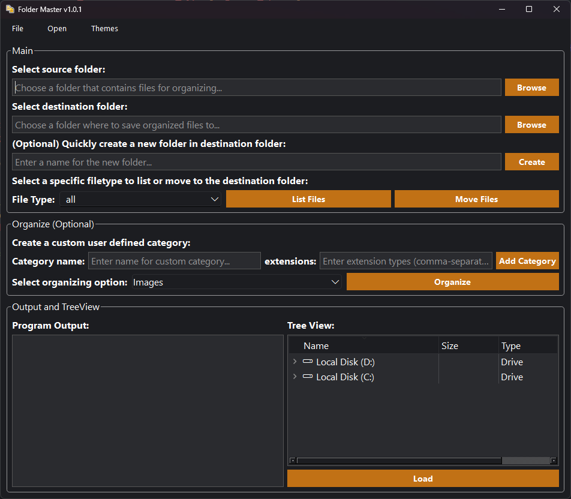

# Folder Master

This program is used to help organize files in a specified folder based on the filetypes which can be selected from a ComboBox.

## Features
- List files based on the selected filetype via the List Files button.
- Move and sort files to a specified destination path via the Move Files button.
- Optional sort and move files based on the optional organization option by category.

## Installation
Tested on Python 3.12.x

Install the needed python packages:
`pip install -r requirements.txt`

## Screenshots of the GUI

